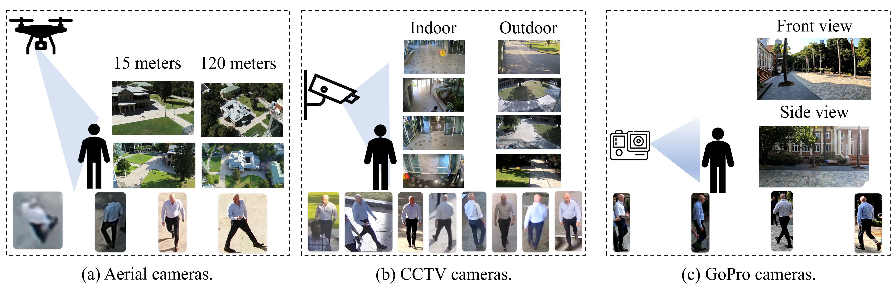

# AG-VPReID: Aerial-Ground Video-based Person Re-Identification

**Official repository for the AG-VPReID Competition**



I'll help you fix the issue with your dataset access documentation. Here's an improved version:

## Dataset Access
The dataset is available for [download on Kaggle](https://www.kaggle.com/competitions/agvpreid25/data).
If you experience download issues, please check the [GitHub issue comment](https://github.com/agvpreid25/AG-VPReID/issues/1#issuecomment-2704873503) for troubleshooting steps.

## Data Structure
The dataset follows a hierarchical organization: `{ID}/{Tracklets}/{Frames}`

- **Person ID**: Unique identifier for each person
- **Camera Types**:
  - `C0/C1`: CCTV cameras (ground-view)
  - `C2/C3`: Wearable cameras (ground-view)
  - `C4/C5`: UAV cameras (aerial-view)
- **Frame Format**: `Fxxx` (where xxx is the frame number)

## Evaluation Protocol
The competition evaluates performance on two distinct scenarios:
1. **Aerial-to-Ground**: Queries from aerial cameras, gallery from ground cameras
2. **Ground-to-Aerial**: Queries from ground cameras, gallery from aerial cameras

### Benchmark Results

| **Method** | **Aerial-Ground** | **Ground-Aerial** | **Overall** |
|------------|-------------------|-------------------|-------------|
|            | R1/R5/R10/mAP     | R1/R5/R10/mAP     | R1/R5/R10/mAP |
| Baseline 1 | -/-/-/-           | -/-/-/-           | -/-/-/-       |
| Baseline 2 | -/-/-/-           | -/-/-/-           | -/-/-/-       |
| Baseline 3 | -/-/-/-           | -/-/-/-           | -/-/-/-       |

## Setup Instructions
1. Clone this repository (link to be updated).
2. [Download](https://www.kaggle.com/competitions/agvpreid25/data) the AG-VPReID dataset.
3. Organize the dataset as follows:

```bash
datasets/
    AG-VPReID/
      train/
      case1_aerial_to_ground/
        gallery/
        query/
      case2_ground_to_aerial/
        gallery/
        query/
      attributes/
```

## Submission Guidelines
1. Generate prediction files for both test cases.
2. Merge `submission_case1_aerial_to_ground.csv` and `submission_case2_ground_to_aerial.csv` maintaining the header.
3. Submit the merged file to the AG-VPReID competition on Kaggle for evaluation.

## FAQs
This section will be updated regularly as new information becomes available.
